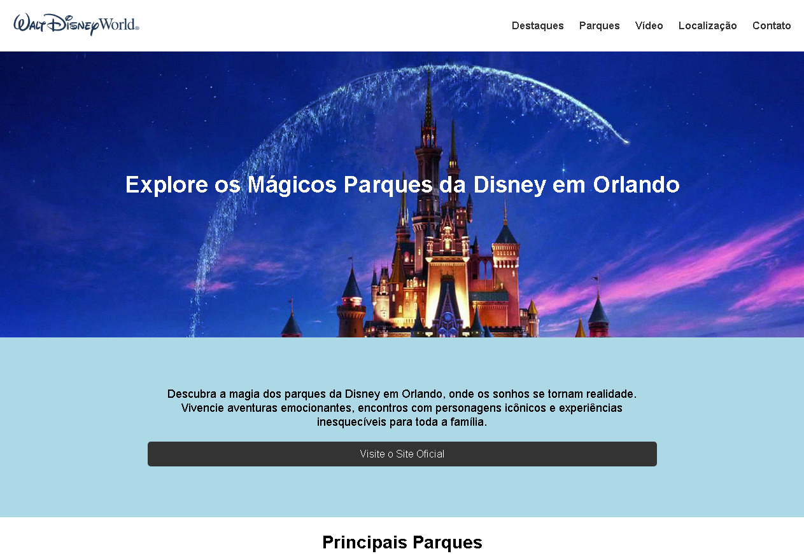

# Projeto final do Descodificadas da Trilha 1

> Projeto final do Descodificadas da Trilha 1

[🔗 Clique aqui para acessar] (https://lineeiko.github.io/projeto_final_descodificadas_trilha_1/)

#### Criar um site contendo:
- Logotipo 
- Menu 
- Título destacado sobre o assunto do site com imagem do fundo 
- Trecho de texto com plano de fundo colorido 
- Botão com link interno ou externo 
- Imagens com descrições 
- Vídeo 
- Mapa de localização 
- Formulário para coletar cadastro 
- Rodapé com a frase criado por seunome 

>Descodificadas

O Descodificadas  é um programa que tem como objetivo de formar e apoiar mulheres que buscam entrar e já estão no setor de tecnologia por meio de uma metodologia que as ensinam a aprender independentemente através de conteúdos e práticas simples e descomplicadas buscando facilitar o processo de aprendizado.

O Programa tem a duração de 2 anos para a formação completa e é composto por 4 trilhas de aprendizagem, cada uma delas com duração de 6 meses.
As trilhas de aprendizagem são compostas por dois componentes que envolvem a formação específica na área desenvolvimento web – um de conteúdo e um de prática – e um componente de competências socioemocionais que visa o autodesenvolvimento.

## 🛠 Tecnologias

- HTML
- CSS
- Git e Github